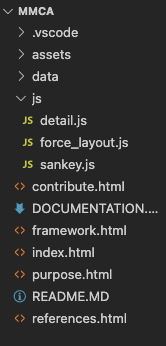
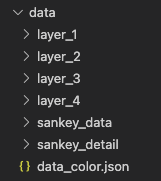
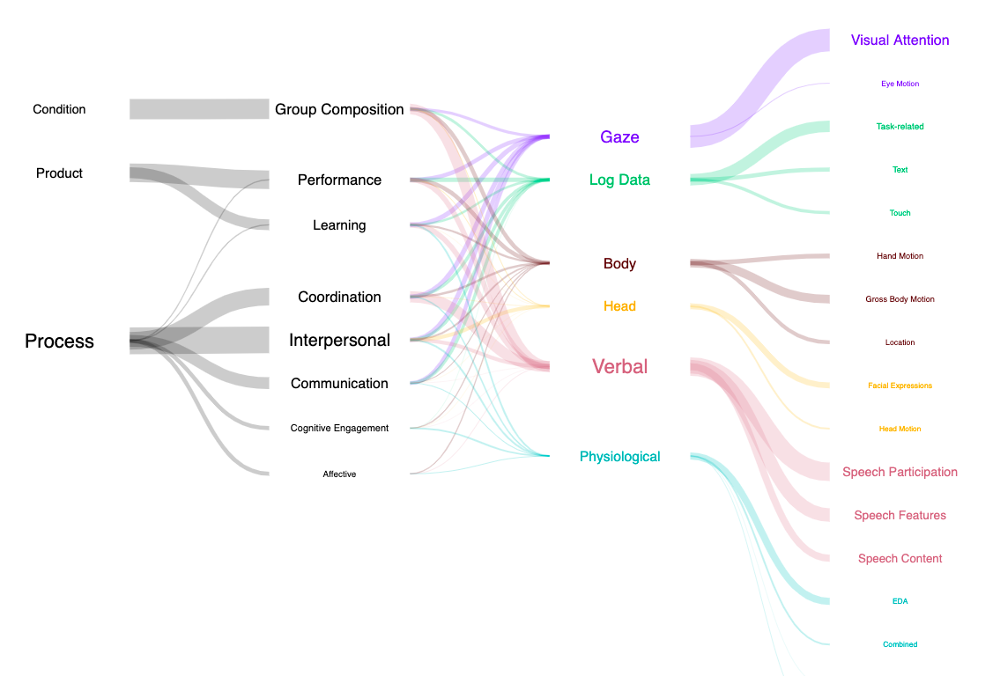
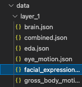
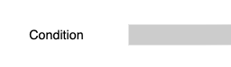
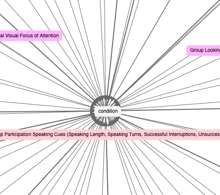
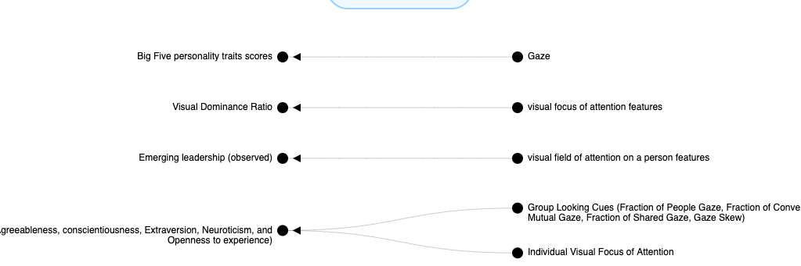
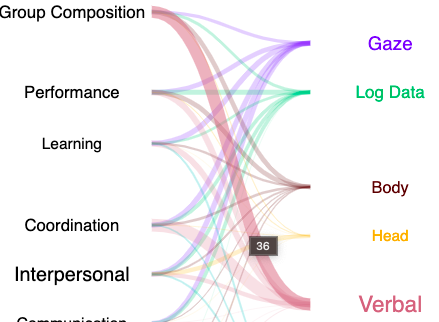
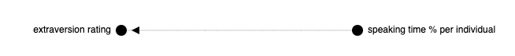

## MMCA - Documentation

## Folder structure and high level view

</img>

- ``` .vscode ``` is an autogenerated folder by Visual Studio Code.
- ``` assets ``` folder that contains the CSS file and images.
- ``` data ``` folder contains ALL data JSON data files.
- ``` js ``` folder contains ALL JavaScript files that create the visual graphs seen on the website.
- ``` _____.html ``` .html files are the frontend of the website. ``` index.html ``` is the main.

## Data  structure

</img>

```layer 1```, ```layer 2```, ```layer 3```, ```layer 4``` symbolize the layers in the Sankey diagram. <br>

</img>

- ```layer 1``` is composed of data such as Visual attention, Eye Motion, Task-related, Text, Touch, etc.
- ```layer 2``` is composed of data such as Gaze, Log Data, Body, etc.
- ```layer 3``` is composed of data such as Group Composition, Performance, Learning, etc.
- ```layer 4``` is composed of data such as Condition, Product, and Process.

<br>

### JSON Data

To understand what JSON is, here is a great link! https://www.w3schools.com/whatis/whatis_json.asp

</img>

To understand how the JSON data is structured let's look at an example such as ```facial_expressions.json```

```"nodes": [...]``` The nodes array contains all the node objects. 

Example:
```{"id": 1, "name": "Facial Expressions", "url": "parent"},``` <br>

- The first node has an ```id``` of ```1```. 
- A name with ```"Facial Expressions"```, and the URL that links to the Google Scholar link.
- Because this first line is the center of the node, ```"Facial Expressions"```, it has a URL of ```parent```. This allows D3 to identify which the center node is, and give it its white color and no link when graphing. 

<br>

```"links": [...]``` is the part of the JSON data that now connects all the nodes. 

Example: 
```{"source": 2, "target": 1, "type": "glm", "linetype": "0,0", "linelevel": "1"},``` <br>

- ```"source": 2, "target": 1``` is connecting node with id 2 to node with id 1. This would connect node 2 with the name ```Facial expression``` to the main center node, ```Facial Expressions```. 
- ```"type": "glm"``` is the label of the data. 
- ```"linetype": "0,0"``` indicates whether or not the line is dotted or straight. ```"0,0"``` indicates the stroke of the line, in this case, it would be a straight dark line. To change it to a dotted line, change the value to ```"5,5"```. 
- ```"linelevel": "1"``` indicates the thickness of the line, the stroke width.  

<br>

### layers.json (located under sankey_data folder)

This JSON file contains the data and structure needed to create the Sankey diagram you see when you first enter the website.
</img>

Upon inspecting the ```layers.json```, let's take a look at the data within the nodes array on the very first line, ```"nodes":[...]```:

```{"node":0, "name":"Condition", "data_link": "/data/layer_4/condition.json", "node_color": "gray", "fontSize": 13, "num_connections": 69},```

- This is node 0
- Based on the name this is the condition node (see image below)

</img>

- There is a ```"data_link":``` property that points to a file ```"/data/layer_4/condition.json"```. the ```condition.json``` file under that directory is used to create the layout below upon clicking on the condition node (see image below).

</img>

- ```"node_color": "gray"``` sets the color of the text which is gray. 
- ```"fontSize": 13``` sets the size of the font, how big it will appear. 
- ```"num_connections": 69``` is the actual metric. 

Now in the ```"links":[...]``` you will see all the nodes start to connect again. Like node 0 connect to node 3 on the first line:
```{"source":0, "target":3, "value":1, "link_width": 69, "d_link": ""},```

- ```source``` is where it starts.
- ```target``` is where it is connecting to.
- ```"value":1``` There is only 1 value in this case. one node. 
- ```"link_width": 69``` is the thickness of the line that connects the nodes. 
- ```"d_link"``` is the pointer to the detail data of that connection to generate a detailed chart. But in this case, the link between ```condition``` and ```Group composition``` does not contain one. So if you click on the link between them, no chart will appear. But if you clicked on, for example, Gaze --> Group composition, the following would appear (see image below).

</img>

<br>

### sankey_detail folder

As an example, under the ```verbal``` folder, let's go to ```verbal_group.json```. The name is ```verbal_group.json``` because this is the link that connects verbal to group composition (group for short in the naming). 

</img>

Upon inspecting the ```verbal_group.json``` file you will notice a different format of data. Within the ```"data": [...]```, you will see this type of format: 

```
    {    
        "name": "extraversion rating",
        "children": [
            { "name": "speaking time % per individual", "link": "Employing%20Social%20Gaze%20and%20Speaking%20Activity%20for%20Automatic%20Determination%20of%20the%20Extraversion%20Trait" } 
        ]
    },
```

- The ```"name"``` represents the "parent" node of the detail graph (see below). 

</img>

- And inside the ```"children": [...]``` contains all the connected "children" nodes that connect to the "parent" node. 
- For this specific example you can see that there is a "child" within the "children" nodes, represented as ```{ "name": "speaking time % per individual", "link": "Employing%20Social%20Gaze%20and%20Speaking%20Activity%20for%20Automatic%20Determination%20of%20the%20Extraversion%20Trait" } ```. The ```name:``` is the name of the "child" node and the ```"link"``` is the link to the Google Scholar link.

<br>

### data_color.json

data_color.json is a JSON file that contains a dictionary of all the nodes and their respective colors. 
Example: 
```"brain synchrony": "Color_6",``` <br>

brain synchrony has a color of ```"Color_6"```. These colors can be found and modified in the JS file ```force_layout.js``` under the js folder.

```
    const colorScale  = d3.scaleOrdinal()
        .domain(["Color_1", "Color_2", "Color_3", "Color_4", "Color_5", "Color_6", "Parent_color"])
        .range(['#ffbfff','#a3ffab','#ffcba6', '#feffc0', '#ffd4dc', '#b5ffff', '#f5f2f2'])
```

- The ```Parent_color``` is just the color of the center node, which I set to a very light gray (almost white).

<br>

## JavaScript Files/Information

### sankey.js
This file generates the Sankey layout diagram of the high-level view of all the nodes.

</img>

<br>

### force_layout.js
This file generates the force layout diagram of the nodes upon clicking on a node.

</img>

<br>

### detail.js
This file generates a detailed diagram of the links (see image below for example).

</img>

<br>

## HTML Files

### index.html

This file contains all elements required to display everything you see on the frontend when you go to https://mmca-website.netlify.app/.
